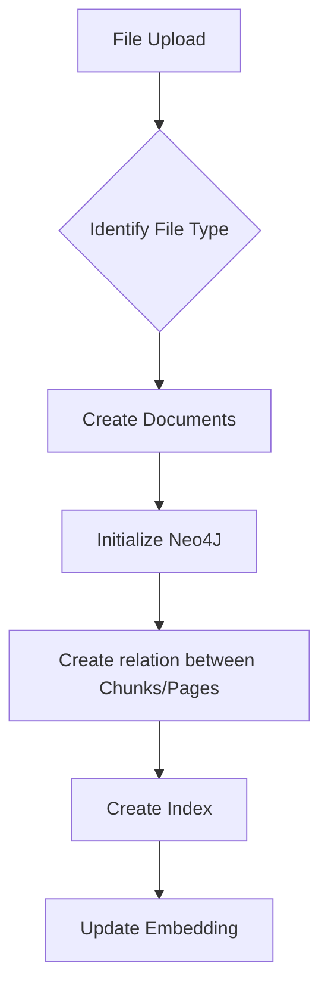

# LLM Graph Builder

```mermaid
flowchart TD
    A[File Upload] --> B{Identify File Type}
    B --> C[Create Documents]
    C --> D[Initialize Neo4J]
    D --> E[Create relation between Chunks/Pages]
    E --> F[Create Index]
    F --> G[Update Embedding]
```