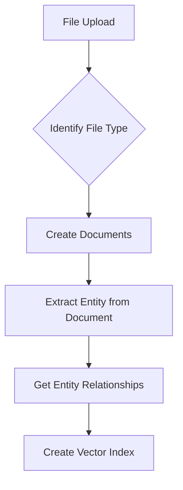
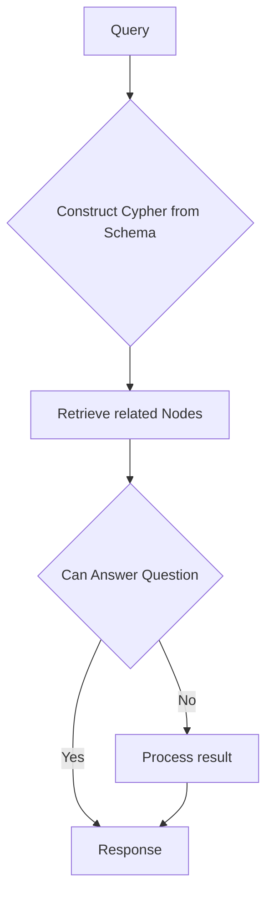

# Knowledge Graph Builder

## Graph Creation

```mermaid
flowchart TD
    A[File Upload] --> B{Identify File Type}
    B --> C[Create Documents]
    C --> D[Extract Entity from Document]
    D --> E[Get Entity Relationships]
    E --> F[Create Vector Index]
```

## Question Answering

```mermaid
graph TD
  A[Query] --> B{Construct Cypher from Schema}
  B --> C[Retrieve related Nodes]
  C --> D{Can Answer Question}
  D -->|Yes| E[Response]
  D -->|No| F[Process result]
  F --> E
```