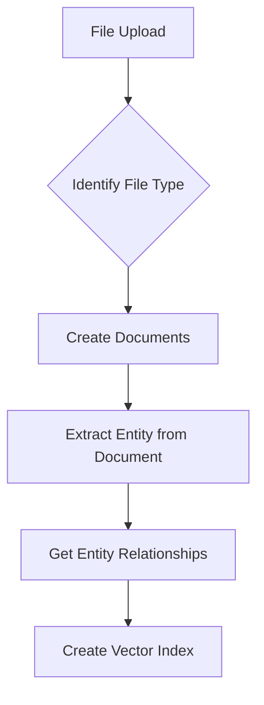
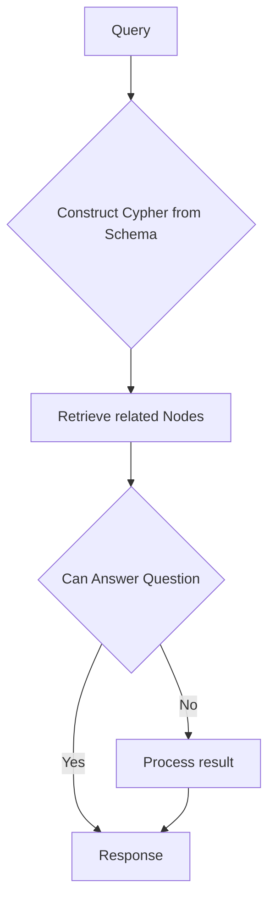

# Knowledge Graph Builder

## Graph Creation

The Builder supports two modes of operation when creating the nodes. This can be toggled by setting `use_v2_chain` in [Neo4JKnowledgeGraph](/utils/custom/knowledge_graph.py#L40). When set to `False` less number of nodes will be created. It defaults to `True`. This might be useful in some cases. 

## Question Answering
