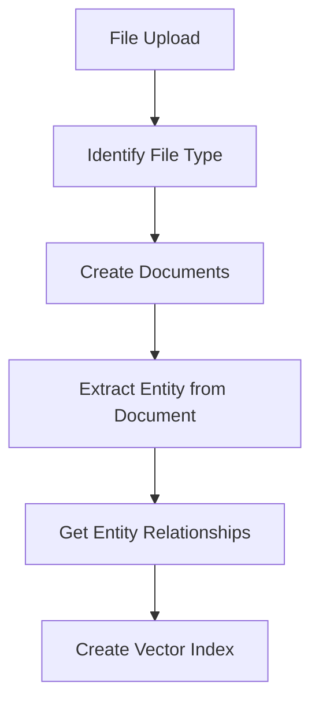
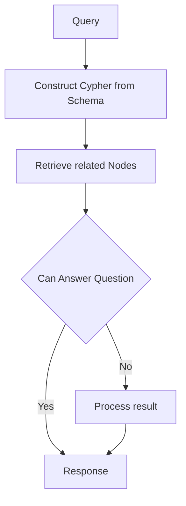

# Knowledge Graph Builder


## Graph Creation


### Installation


First, install the dependenices
```bash
pip install -r requirements.txt
```

### Configure Neo4J (Dozerdb)

Next, install Neo4j. I recommend doing this [Dozerb](https://dozerdb.org/) as it offers enterprise features in the community edition. You can use this [script](./install_dozerdb.sh) to get a docker container running.

### Configure LLM, Embeddings

You can use Azure OpenAI, Ollama or your custom provider. You just need to define your LLM and Embeddings model in [llm_core.py](./utils/common/llm_core.py)

### Usage

Once complete you can set your `FILE_PATH` in [knowledge_graph_creator.py](./knowledge_graph_creator.py) and run the python script. It should you populate you Neo4J database.


The Builder supports two modes of operation when creating the nodes. This can be toggled by setting `use_v2_chain` in [Neo4JKnowledgeGraph](/utils/custom/knowledge_graph.py#L40). When set to `False` fewer nodes will be created. Defaults to `True`.


## Question Answering



You can perform QA on your knowledge graph using the streamlit application at [graph_qa_chatbot.py](./graph_qa_chatbot.py)

```bash
streamlit run graph_qa_chatbot.py
```